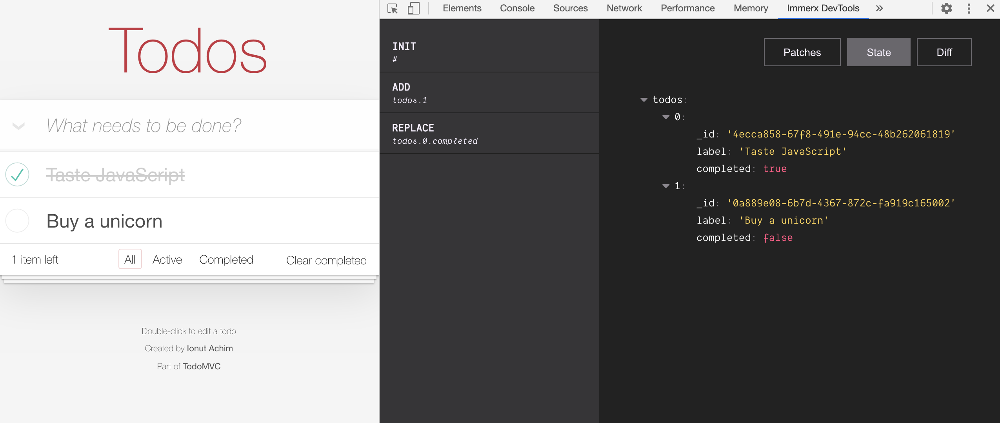
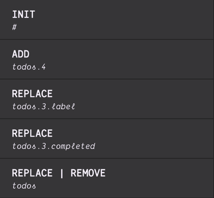
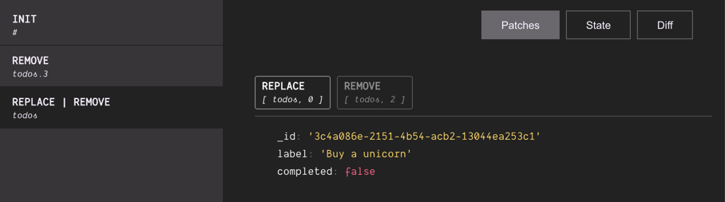
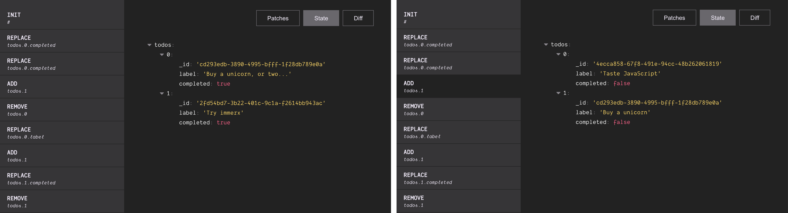
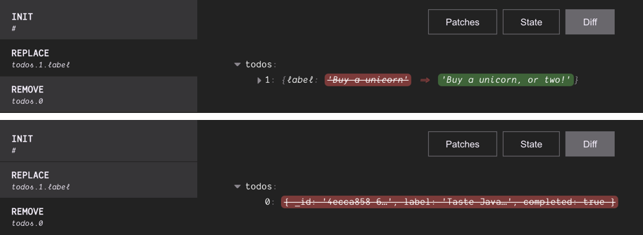

**DevTools** middleware for [ImmerX](https://github.com/monojack/immerx)

<br/>



### Install the Chrome DevTools Extension

For now, you can only install the extension manually. There is a review in process for adding it to the Chrome Web Store and I will update as soon as it's approved.

1. Download the `devtools-extension.zip` file from the [releases page](https://github.com/monojack/immer-devtools/releases) and unzip it anywhere you like
2. Navigate to `chrome://extensions` or from the menu - `More Tools -> Extensions`
3. Enable `Developer mode` from the top-right corner
4. Click on `Load unpacked` and select the unzipped folder

**Note**: The panel will not show up in the developer tools until you've [set up](#setup) the middleware.

### Middleware setup

We just create the middleware and add it to the middleware list when creating the **immerx** state.

```js
import { create } from '@immerx/state'
import { createDevToolsMiddleware } from '@immerx/devtools'

const devToolsMiddleware = createDevToolsMiddleware()
create(
  {
    todos: [{ label: 'Taste JavaScript', completed: false }],
  },
  [devToolsMiddleware], // <-- here
)
```

### Interface

Here are the different views and elements of the **DevTools** interface.

#### `Update List`



Note that this is a list of updates, not patches. As a result of updating the state you may be replacing some value, remove other, or maybe even add some. Immer will generate a patch for each of these operations, so an update may contain 0 or more patches. If an update contains more than one patch, it will display all the performed operations and the common path for all of them.

The first entry - **`INIT`** - is not actually an update, but it represents the initial value of our state.

<br/>

#### `Patches`



By switching to the **`Patches`** view we can see a list with all of the patches that were applied during the selected update.

<br/>

#### `State`



This is where we have a view of the entire **`state`** tree. Whether it is the most recent value - when there's no selection _(left)_ - or the value relevant to the selected update _(right)_

<br/>

#### `Diff`



Diffing is done with [@immerx/patchdiff](https://github.com/monojack/immerx-patchdiff) and it's strictly based on immer patches, meaning that we'll see exactly what and how it changed rather than a deep diff. This is a lot more relevant and helps us spot and remediate irrelevant changes to leverage [structural sharing](https://egghead.io/lessons/react-profile-react-rendering-and-optimize-with-memo-to-leverage-structural-sharing).

<br/>

### Demo

[Todo MVC](https://monojack.github.io/immerx-todomvc/)
